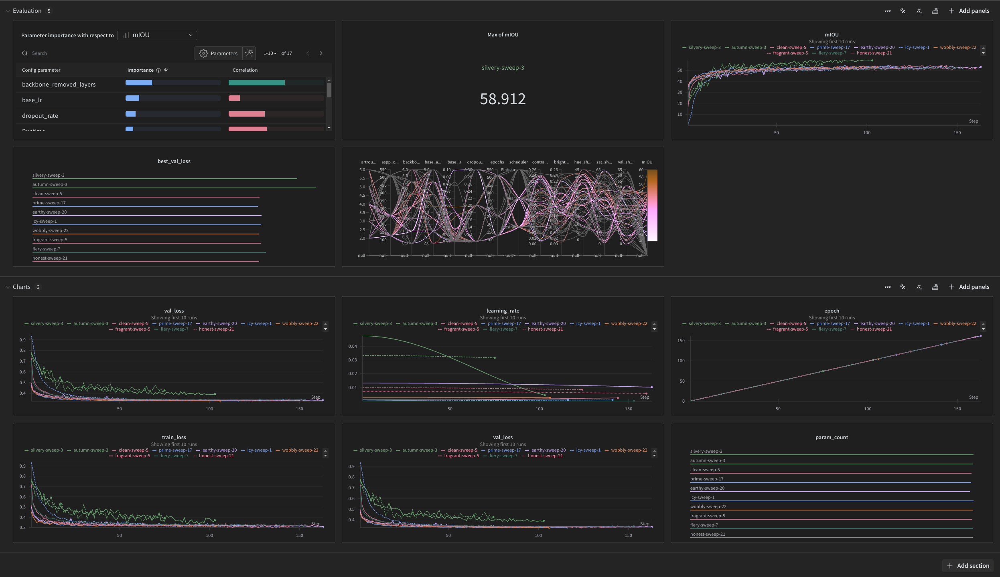

## Code folders structure
```
CE7454-Project1-CelebAMask-Face-Parsing
│   best_model_bzwql5yt.pth
│   lovasz_losses.py - Lovász-Softmax loss function for PyTorch from https://github.com/bermanmaxim/LovaszSoftmax
│   model.py - Containing model architecture
│   README.md - This file
│   requirements.txt - prequisted Python libraries
│   test.py - Inferencing model on the test dataset (hyperparameters pre-specified in the script). Also save output mask at dataset/test/test_pred directory.
│   test_wandb.py - Inferencing model on the test dataset (hyperparameters with specified {run_id} pulled from WandB API). Also save output mask at dataset/test/test_pred directory.
│   train.py - Training script without hyperparameter tuning
│   tune.py - Start WandB sweep agent on training script for hyperparameter tuning (can be run distributively across multiple machines)
│   utils.py - Utilities scripts including parameter counting function, dataset loading class, label color map
│   val.py - Inferencing model on the validation dataset (hyperparameters pre-specified in the script), then calculate mIOU & F1-score. Also save output mask at dataset/val/val_pred directory.
│   val_wandb.py - Inferencing model on the test dataset (hyperparameters with specified {run_id} pulled from WandB API), then calculate mIOU & F1-score. Also save output mask at dataset/val/val_pred directory.
│
└───dataset
│   │   evaluate.py - Provided mIOU calculation script from CE7454 class
│   │   dataset_mean_std.py - Calculate Mean and Standard Deviation of input image (from both training & validation dataset)
│   │   count_label.py - Count each label from both train & val dataset
│   │───train
│   │   │───train_image - Training dataset image
│   │   │       0.jpg
│   │   │       1.jpg
│   │   │       ...
│   │   └───train_mask - Training dataset mask
│   │           0.png
│   │           1.png
│   │           ...
│   │───val
│   │   │───val_image - Validate dataset image
│   │   │       0.jpg
│   │   │       1.jpg
│   │   │       ...
│   │   │───val_mask - Validate dataset mask
│   │   │       0.png
│   │   │       1.png
│   │   │       ...
│   │   └───val_pred - Prediction masks from tuned model on the validatation dataset
│   │           0.png
│   │           1.png
│   │           ...
│   │───test
│   │   │───test_image - Test dataset image
│   │   │       0.jpg
│   │   │       1.jpg
│   │   │       ...
│   │   └───test_pred - Prediction masks from tuned model on the test dataset
│   │           0.png
│   │           1.png
│   │           ...
│───wandb - hyperparameter tuning logging folder
│   │───run-{timestamp}-(run_id) - Folders containing each run
│   │   │
│   │   └───files
│   │       │───config.yaml - Value of hyperparameters used in this run
│   │       │───output.log - Terminal output during training (e.g. from print() function)
│   │       │───wandb-metadata.json - System metadata of the machine that executed this run
│   │       └───wandb-summary.json - Summarization of this run, containing parameters count, epoch, best validation loss, final mIOU, final training loss, final validation loss
│   │    
│   │───run-20241014_230114-bzwql5yt - Folder containing the best run
│   └───sweep-{sweep_id} - Folder containing hyperparameter configs from each machine
│           config-{run_id}.yaml - Value of hyperparameters used in specified {run_id}
└───images - Images from README.md
```

## How To RUN
### Prepare Python virtual environment
- Get [anaconda3](https://www.anaconda.com/download)
- create new virtual environment called "ce7454" and install required libraries.
```shell
conda create -n ce7454
conda activate ce7454
# Install PyTorch with GPU support https://pytorch.org/get-started/locally/
conda install pytorch torchvision pytorch-cuda=12.4 -c pytorch -c nvidia
pip install -r requirements.txt
```

### Prepare Hyper-parameters Tuning
- Get WandB api key from [it's website](https://docs.wandb.ai/quickstart/)
- Start Hyperparameter Tuning
```shell
# Please specify your api key
python tune.py -k=${api_key}
```

Succeed hyperparameters tuning also provided at [WandB Interactive Dashboard](https://wandb.ai/teerameth/CE7454-Project1-CelebAMask-Face-Parsing-V2?nw=nwuserteerameth)
